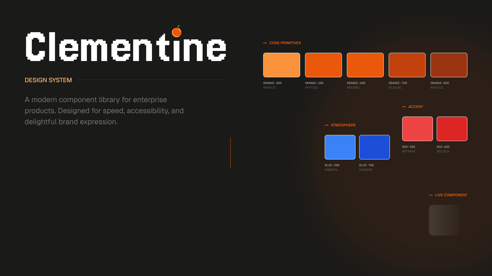
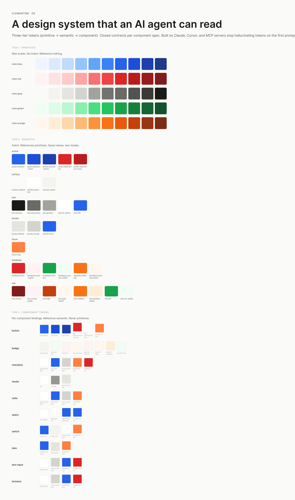
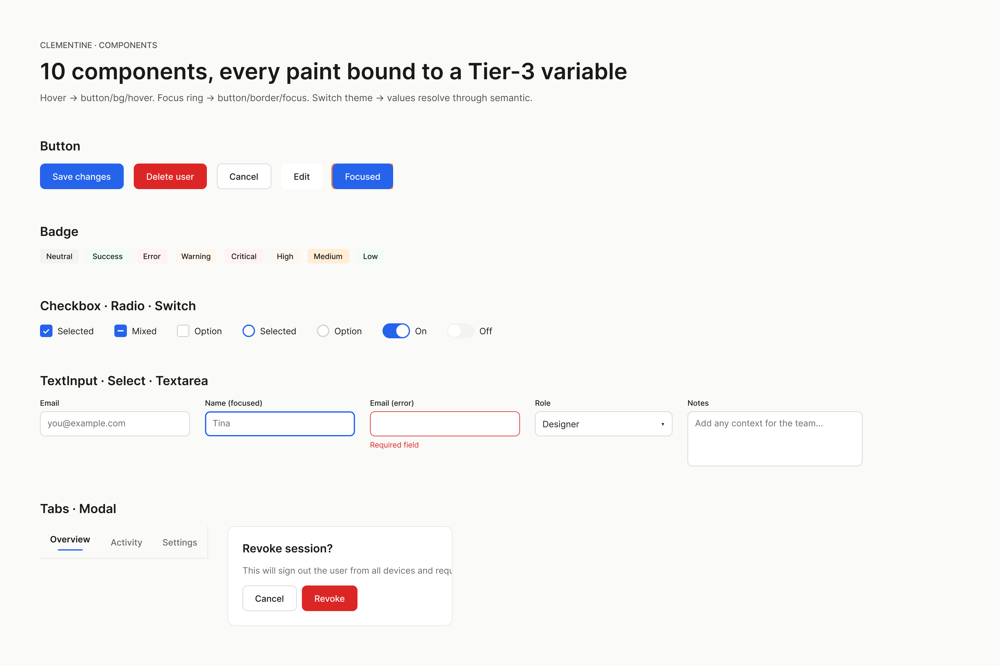
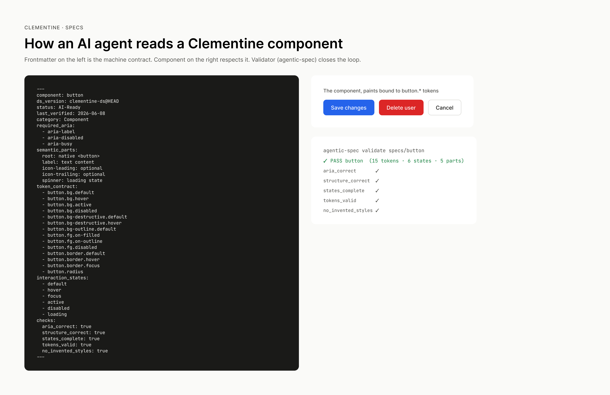

# clementine-ds — an agentic design system

[](https://clementineds.mintlify.app)
[](https://clementine-ds-site.vercel.app)
[](https://clementine-ds-storybook.vercel.app)
[](https://github.com/tishsingh399/clementine-ds/actions/workflows/ci.yml)
[](https://github.com/tishsingh399/clementine-ds/actions/workflows/codeql.yml)
[](https://tinasingh.notion.site/Clementine-DS-379e72c9cf36806f9a5ce8fdb927b93f)
[](https://github.com/tishsingh399/agentic-spec)
[](./LICENSE)



A small, opinionated React design system that ships with **machine-readable specs** for every component. Built so AI agents (Claude, Cursor, Copilot, MCP servers) can read the contract, validate against it, and extend the system without hallucinating tokens or breaking accessibility.

> Most design systems ship code + Storybook and hope documentation keeps up. This one ships a third artifact — `/specs/<component>/` — that an agent can load and treat as the source of truth. See [AGENTS.md](./AGENTS.md) for the contract, and [AI-READY-ARCHITECTURE.md](./AI-READY-ARCHITECTURE.md) for the 9-tray AI-ready roadmap (foundations → components → AI surfaces → behavior → trust → eval loop).

## Where this system lives

| Surface | Where | What it holds |
|---|---|---|
| 📦 Code | This repo | React components, 3-tier tokens, per-component specs |
| 🍊 Live Playground | [clementine-ds-site.vercel.app](https://clementine-ds-site.vercel.app) | Marketing overview + interactive contract playground for the Clementine story: component preview, closed token contract, ARIA requirements, agent packet, verifier route |
| 🚀 Live Storybook | [clementine-ds-storybook.vercel.app](https://clementine-ds-storybook.vercel.app) | <!-- COUNTS:components -->121<!-- /COUNTS --> components (UI + AI surfaces + enterprise) running live; component paint resolves through the 3-tier cascade (verified by `pnpm validate`), auto-deploys on `git push origin main` after CI passes |
| 📘 Mintlify docs | [clementineds.mintlify.app](https://clementineds.mintlify.app) | Hosted docs site, auto-synced from this repo. Same content as `docs/readme/` and the Notion tree, with Mintlify's native search + nav. |
| 📐 Figma | [Clementine DS Figma file](https://www.figma.com/design/w4JB0MOEIzOtSKx5Y3YSQR/Clementine-DS) | 3 variable collections; **all <!-- COUNTS:components -->121<!-- /COUNTS --> components' tokens synced as variables (<!-- COUNTS:component-tokens -->628<!-- /COUNTS --> component vars, cascade-aliased; diffed against code by [`scripts/figma-parity.mjs`](./scripts/figma-parity.mjs))** + rendered as real components across 7 category pages — Actions & Inputs · Containers & Navigation · Display & Feedback · AI Surfaces · Enterprise · Trust & Feedback · Dates, Charts, Toast & Carousel — plus a Cover page. Component paint resolves through the Tier-3 → semantic → primitive cascade at runtime; contract parity is checked by [`scripts/parity-report.mjs`](./scripts/parity-report.mjs). |
| 📓 Notion | [Clementine DS](https://tinasingh.notion.site/Clementine-DS-379e72c9cf36806f9a5ce8fdb927b93f) | Architecture, Tokens, Components, Operations — the narrative version |
| 🛠 CLI | [`agentic-spec`](https://github.com/tishsingh399/agentic-spec) | Validates specs, scaffolds new ones, bridges Figma |
| ✅ Governance proof | [`MILESTONE.md`](./MILESTONE.md) · [`docs/governance-proof.html`](./docs/governance-proof.html) | Live milestone proof: 7/7 seeded agent mistakes surfaced, 121 specs validate, 100% contract parity, Badge closed through the diagnose → fix → verify loop |
| 🖼 Article assets | [`docs/article/`](./docs/article) · [`docs/marketing/`](./docs/marketing) | Diagrams, captions, and launch copy for explaining the token path, check-honesty problem, quiet failure modes, and governance loop |
| 🧪 AI tool adapters | [`docs/AI-TOOL-ADAPTERS.md`](./docs/AI-TOOL-ADAPTERS.md) | Testing plan for how different AI tools consume Clementine: Git-native agents can read the repo directly, while Figma Make and Claude Design may need tool-specific kits |
| 📄 Long-form docs (GitHub) | [`docs/readme/`](./docs/readme) | 20 source pages — getting-started, architecture, tokens, components. GitHub renders with TOC + syntax highlighting. |
| 📓 Long-form docs (Notion) | [Documentation tree](https://tinasingh.notion.site/Documentation-37ae72c9cf36815792daccfb95906b2d) | Same 20 pages published as Notion sub-pages under Clementine DS — readable on any device, no clone needed. |

All five reference the same closed contract. Drift between them is mechanical to detect.

## The same system, in Figma

Clementine lives in code, in Figma, and as machine-readable specs. The cascade is preserved across all three.

### 3-tier token board



The board above captured the initial snapshot — 52 primitives, 32 semantic tokens (Light + Dark modes), 102 component tokens. The system has since grown to **<!-- COUNTS:primitives -->89<!-- /COUNTS --> primitives, <!-- COUNTS:semantic -->41<!-- /COUNTS --> semantic tokens, and <!-- COUNTS:component-tokens -->628<!-- /COUNTS --> component tokens** — all three Figma variable collections still cross-reference exactly like the JSON source files. Switch the Semantic collection's mode and every paint on every component reflows.

### Components board



Paints are bound to Clementine variables (99% coverage; 37 documented intentional holdouts). Hover on the Button → swaps to `button/bg/hover`. Focus ring → `button/border/focus`. The code-contract variables are diffed against Figma; Figma-only shell variables are documented separately instead of being counted as component-contract drift.

### Spec board



The actual YAML frontmatter from [`specs/button/index.md`](./specs/button/index.md) sits next to the live component. The `agentic-spec validate` output shows all 5 gates green. This is how the contract works: a human or an agent looks at the spec, looks at the component, and knows in one glance whether they match.

> **Pushed by [`silships/figma-cli`](https://github.com/silships/figma-cli) + a small custom script.** The CLI talks to Figma Desktop via a local plugin; the script creates 3 variable collections, sets up the cascade, and renders all 10 components as Auto Layout frames bound to component-tier variables. See [`docs/figma/`](./docs/figma) for the exported PNGs and the `push-clementine.mjs` source.

## What's inside

| Package | What |
|---|---|
| [`packages/tokens`](./packages/tokens) | Style Dictionary source: primitives → semantic-light → semantic-dark |
| [`packages/ui`](./packages/ui) | <!-- COUNTS:components -->121<!-- /COUNTS --> React components (UI + AI surfaces + enterprise + dates/charts/toast/carousel) + 3 behavior hooks, Mantine-backed |
| [`apps/storybook`](./apps/storybook) | Live component sandbox |
| [`specs/`](./specs) | ⭐ Per-component agentic specs (frontmatter contract + closed token list) |
| [`_templates/`](./_templates) | Scaffolding for new specs |
| [`guidelines/`](./guidelines) | Cross-cutting design principles |

## Components

**<!-- COUNTS:components -->121<!-- /COUNTS --> components across the trays** — full map + per-component specs in **[AI-READY-ARCHITECTURE.md](./AI-READY-ARCHITECTURE.md)** and [`specs/`](./specs). Every one ships tokens + spec + story + guidance.

**Tray 2 · Components (77)**
- *Actions & inputs (28):* Button · TextInput · Textarea · Select · Autocomplete · NumberInput · PasswordInput · PinInput · FileInput · MultiSelect · TagsInput · Checkbox · Radio · Switch · SegmentedControl · Slider · Rating · Fieldset · IconButton · ButtonGroup · SplitButton · ColorInput · SearchField · Fab · FieldLabel · HelperText · ValidationMessage · CharacterCounter
- *Containers & nav (12):* Card · Accordion · Drawer · Modal · Tabs · Menu · Popover · HoverCard · Breadcrumbs · Pagination · Stepper · Divider
- *Display & feedback (30):* Badge · Alert · Tooltip · Avatar · Chip · Indicator · Loader · Progress · Skeleton · Notification · Table · Timeline · Spoiler · ThemeIcon · Code · Kbd · Anchor · Pill · List · Tree · Image · StatusDot · Stat · DescriptionList · EmptyState · ErrorState · SuccessState · LoadingState · InlineMessage · ProgressCircle
- *Dependency-gated (7):* DatePicker · DateInput · Calendar · Toast · Chart (Area/Line/Bar) · Sparkline · Carousel — built on `@mantine/{dates,notifications,charts,carousel}`

**Enterprise layer (14):** BulkActionBar · FacetedFilter · SavedViews · ExportMenu · NotificationCenter · PresenceIndicator · ActivityFeed · CommentThread · Mention · RbacMatrix · AuditLogViewer · SessionDeviceList · RolePicker · MaintenanceBanner

**Tray 4 · AI surfaces (28):** Message · Composer · ReasoningTrace · ToolCallCard · HITLGate · CitationChip · StreamingText · ArtifactFrame · PromptSuggestions · SourcesPanel · ConfidenceMeter · ModelSelector · CodeBlock · AttachmentPill · ConversationThread · MessageActions · ContextMeter · DiffView · AgentStatus · PlanSteps · PermissionRequest · UndoBar · RefusalState · AgentCard · AgentPicker · MemoryPanel · SessionList · CostMeter

**Tray 7 · Trust (1):** DisclosureBadge   ·   **Tray 8 · Feedback (1):** FeedbackControl   ·   **Tray 5 · Behavior hooks (3):** `useStreaming` · `useInterruptible` · `useRetry`

**Patterns (22):** composed multi-component flows — action-bar, confirm-dialog, form-field, data-table, empty-state, wizard, + 16 agentic / governance patterns. See [`patterns/`](./patterns).

`AI-Ready` means all five `checks:` pass the validator (`pnpm validate`) **and** the spec holds ≥80% contract parity in [`scripts/parity-report.mjs`](./scripts/parity-report.mjs) — every declared token exists in the component-tier file and resolves through the cascade. Specs below that bar, or with a `last_verified` older than 90 days, are demoted to `In progress` until re-verified (see [`.agenticspec.config.json`](./.agenticspec.config.json)). Current per-spec parity: [`apps/observatory/parity-report.json`](./apps/observatory/parity-report.json).

## Quick start

```bash
pnpm install
pnpm storybook         # http://localhost:6006
pnpm build             # build all packages
pnpm validate          # validate all 121 spec contracts
```

## See the agentic loop in 60 seconds

The point of Clementine is the contract, so start there. Pick one component and follow it end to end:

```bash
# 1. read the contract an agent reads before writing code
cat specs/button/index.md          # closed token list, states, named parts
cat specs/button/tokens.json       # the exact tokens this component may use

# 2. enforce it — the validator fails loudly if the spec and tokens disagree
npx -y github:tishsingh399/agentic-spec validate specs/button

# 3. see the same contract rendered live
#    → https://clementine-ds-storybook.vercel.app  (Button)
```

That same loop holds for all 121 components. `pnpm validate` runs it across the whole system; it's also one of the four CI gates every PR must pass.

## Why agentic?

When an AI agent (Claude Code, Cursor, an MCP server) is asked to build a screen using this system, the failure modes are predictable:

- Invents tokens that don't exist (`color.brand.primary`)
- Misses required ARIA (focus ring, `aria-busy` on loading)
- Skips an interaction state (focus, disabled, loading)
- Picks the wrong variant for the context

The specs in `/specs/` are designed to eliminate those failures by making the contract explicit and closed:

- **Closed token list** — `specs/<component>/tokens.json` is the complete set of tokens that component may use. Anything else is a lint failure.
- **Named parts** — every token must target a declared region (`root`, `label`, `icon-leading`).
- **Required states** — `interaction_states:` enumerates what must exist in code + stories.
- **Source pointers** — the spec tells the agent exactly which file to open.

The agent reads the spec first, then writes the code. Reverse-engineering from a hex value or a screenshot is no longer needed.

## How to extend

See [AGENTS.md § Workflow: adding a new component](./AGENTS.md#workflow-adding-a-new-component).

Short version:

1. Copy `_templates/component.md.template` → `specs/<name>/index.md`
2. Fill `semantic_parts` + `interaction_states` first
3. Build `tokens.json` from existing semantic tokens (extend `semantic-*.json` if you need new ones — never inline a hex)
4. Implement against the spec in `packages/ui/src/components/`
5. Add a Storybook story per state
6. Flip `status: AI-Ready` when all `checks:` are `true`

## License

MIT — see [LICENSE](./LICENSE).

---

Built by [Tina Singh](https://github.com/tishsingh399). Working on agentic design tooling at the design ↔ code boundary.
