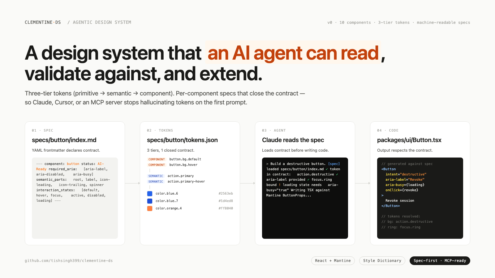

# clementine-ds — an agentic design system

[](https://clementine-ds-storybook.vercel.app)
[](https://github.com/tishsingh399/clementine-ds/actions/workflows/ci.yml)
[](https://github.com/tishsingh399/clementine-ds/actions/workflows/codeql.yml)
[](https://tinasingh.notion.site/Clementine-DS-379e72c9cf36806f9a5ce8fdb927b93f)
[](https://github.com/tishsingh399/agentic-spec)
[](./LICENSE)



A small, opinionated React design system that ships with **machine-readable specs** for every component. Built so AI agents (Claude, Cursor, Copilot, MCP servers) can read the contract, validate against it, and extend the system without hallucinating tokens or breaking accessibility.

> Most design systems ship code + Storybook and hope documentation keeps up. This one ships a third artifact — `/specs/<component>/` — that an agent can load and treat as the source of truth. See [AGENTS.md](./AGENTS.md) for the full architecture.

## Where this system lives

| Surface | Where | What it holds |
|---|---|---|
| 📦 Code | This repo | React components, 3-tier tokens, per-component specs |
| 🚀 Live Storybook | [clementine-ds-storybook.vercel.app](https://clementine-ds-storybook.vercel.app) | 10 components running live, every paint bound to a token, auto-deploys on `git push origin main` after CI passes |
| 📐 Figma | [Tina-DS Figma file](https://www.figma.com/design/MBr4guR2Xtfa92JJXS6472/Tina-DS-file-ANT) | 3 variable collections (Primitives / Semantic Light+Dark / Components), 10 components, spec board |
| 📓 Notion | [Clementine DS](https://tinasingh.notion.site/Clementine-DS-379e72c9cf36806f9a5ce8fdb927b93f) | Architecture, Tokens, Components, Operations — the narrative version |
| 🛠 CLI | [`agentic-spec`](https://github.com/tishsingh399/agentic-spec) | Validates specs, scaffolds new ones, bridges Figma |
| 📄 Long-form docs (GitHub) | [`docs/readme/`](./docs/readme) | 20 source pages — getting-started, architecture, tokens, components. GitHub renders with TOC + syntax highlighting. |
| 📓 Long-form docs (Notion) | [Documentation tree](https://tinasingh.notion.site/Documentation-37ae72c9cf36815792daccfb95906b2d) | Same 20 pages published as Notion sub-pages under Clementine DS — readable on any device, no clone needed. |

All five reference the same closed contract. Drift between them is mechanical to detect.

## The same system, in Figma

Clementine lives in code, in Figma, and as machine-readable specs. The cascade is preserved across all three.

### 3-tier token board


52 primitives, 32 semantic tokens (Light + Dark modes), 102 component tokens. All three Figma variable collections cross-reference exactly like the JSON source files. Switch the Semantic collection's mode and every paint on every component reflows.

### Components board


Every paint on every frame is bound to a `Clementine · Components` variable. Hover on the Button → swaps to `button/bg/hover`. Focus ring → `button/border/focus`. The Figma file is the system; it doesn't drift from code.

### Spec board


The actual YAML frontmatter from [`specs/button/index.md`](./specs/button/index.md) sits next to the live component. The `agentic-spec validate` output shows all 5 gates green. This is how the contract works: a human or an agent looks at the spec, looks at the component, and knows in one glance whether they match.

> **Pushed by [`silships/figma-cli`](https://github.com/silships/figma-cli) + a small custom script.** The CLI talks to Figma Desktop via a local plugin; the script creates 3 variable collections, sets up the cascade, and renders all 10 components as Auto Layout frames bound to component-tier variables. See [`docs/figma/`](./docs/figma) for the exported PNGs and the `push-clementine.mjs` source.

## What's inside

| Package | What |
|---|---|
| [`packages/tokens`](./packages/tokens) | Style Dictionary source: primitives → semantic-light → semantic-dark |
| [`packages/ui`](./packages/ui) | 10 React components, Mantine-backed |
| [`apps/storybook`](./apps/storybook) | Live component sandbox |
| [`specs/`](./specs) | ⭐ Per-component agentic specs (frontmatter contract + closed token list) |
| [`_templates/`](./_templates) | Scaffolding for new specs |
| [`guidelines/`](./guidelines) | Cross-cutting design principles |

## Components

| Component | Status | Spec |
|---|---|---|
| Button | AI-Ready | [specs/button](./specs/button/index.md) |
| Badge | Draft | [specs/badge](./specs/badge/index.md) |
| Checkbox | Draft | [specs/checkbox](./specs/checkbox/index.md) |
| Modal | Draft | [specs/modal](./specs/modal/index.md) |
| Radio | Draft | [specs/radio](./specs/radio/index.md) |
| Select | Draft | [specs/select](./specs/select/index.md) |
| Switch | Draft | [specs/switch](./specs/switch/index.md) |
| Tabs | Draft | [specs/tabs](./specs/tabs/index.md) |
| TextInput | Draft | [specs/text-input](./specs/text-input/index.md) |
| Textarea | Draft | [specs/textarea](./specs/textarea/index.md) |

`AI-Ready` means: every interaction state has a Storybook story, every visual value comes from a declared token, and the spec has been reconciled with the code on `last_verified`.

## Quick start

```bash
pnpm install
pnpm storybook         # http://localhost:6006
pnpm build             # build all packages
```

## Why agentic?

When an AI agent (Claude Code, Cursor, an MCP server) is asked to build a screen using this system, the failure modes are predictable:

- Invents tokens that don't exist (`color.brand.primary`)
- Misses required ARIA (focus ring, `aria-busy` on loading)
- Skips an interaction state (focus, disabled, loading)
- Picks the wrong variant for the context

The specs in `/specs/` are designed to eliminate those failures by making the contract explicit and closed:

- **Closed token list** — `specs/<component>/tokens.json` is the complete set of tokens that component may use. Anything else is a lint failure.
- **Named parts** — every token must target a declared region (`root`, `label`, `icon-leading`).
- **Required states** — `interaction_states:` enumerates what must exist in code + stories.
- **Source pointers** — the spec tells the agent exactly which file to open.

The agent reads the spec first, then writes the code. Reverse-engineering from a hex value or a screenshot is no longer needed.

## How to extend

See [AGENTS.md § Workflow: adding a new component](./AGENTS.md#workflow-adding-a-new-component).

Short version:

1. Copy `_templates/component.md.template` → `specs/<name>/index.md`
2. Fill `semantic_parts` + `interaction_states` first
3. Build `tokens.json` from existing semantic tokens (extend `semantic-*.json` if you need new ones — never inline a hex)
4. Implement against the spec in `packages/ui/src/components/`
5. Add a Storybook story per state
6. Flip `status: AI-Ready` when all `checks:` are `true`

## License

MIT — see [LICENSE](./LICENSE).

---

Built by [Tina Singh](https://github.com/tishsingh399). Working on agentic design tooling at the design ↔ code boundary.
